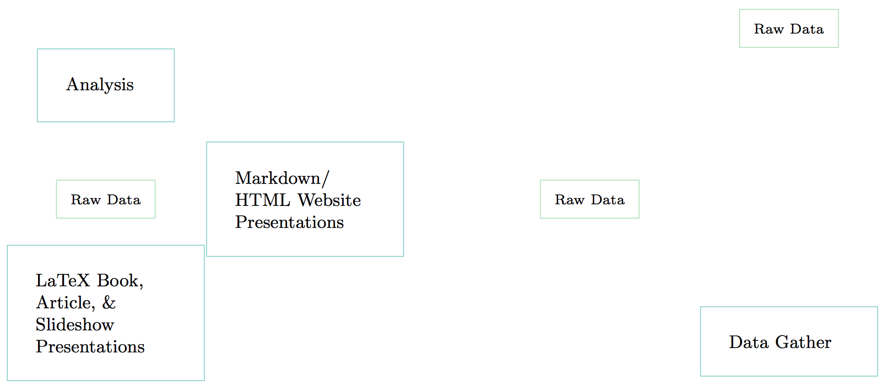
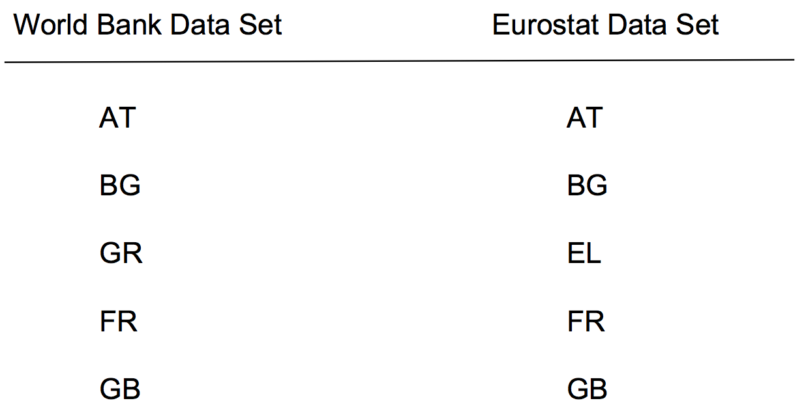
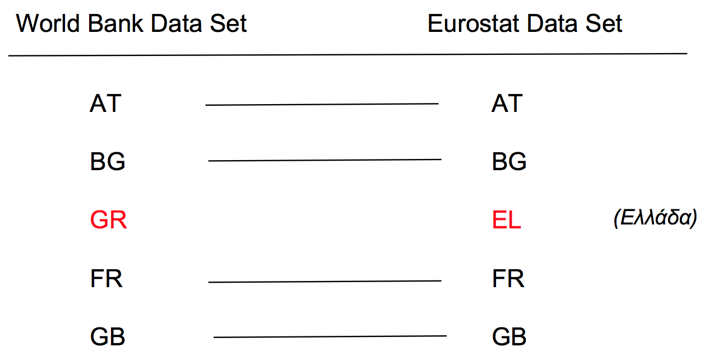
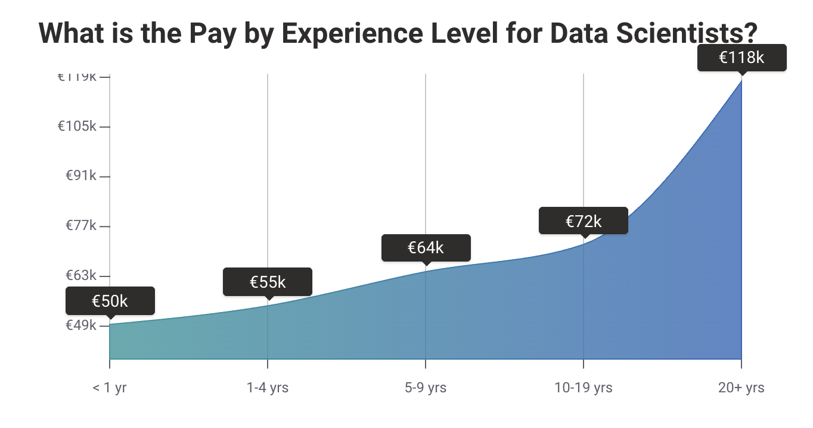

```{r setup, include=FALSE}
library(tidyverse)
theme_set(theme_minimal())
```

---

# Is this research?


---

# Is this research?


---

# No

> Papers, articles, slideshows, talks, books are **advertising, not research**.

---

# What are journal articles/books/etc?

> **Presentation documents**: announce select findings and try to convince an
audience that they are correct.

---

# What is research?

Quantitative research involves the **procedures** and **choices** researchers make to **gather** data, **process** it, and **analysis** it in order to address their research questions.

<br>
<br>

This includes “the **full software environment**, **code**, and **data** that produced the results” (Donoho 2010, 3015).

---

# Quants and computer programming

> The practice of quantitative science **is computer programming**.

<br>

So, we need **computer programming tools** (preview: literate programming).

---

class: inverse, center, middle

# Reproducible Comp. Research

---

# Replicable

<br>
<br>
<br>

**Replicable research**: when there is sufficient information available for independent researchers to make the **same findings**, using the **same procedures** with ***new*** data.

---

# However . . .

Sometimes full replications are not feasible because:

- **limited resources** for gathering new data (e.g. very expensive to build
another Large Hadron Collider),

- the original research already sampled the **universe of cases**.

*So...*

---

# Reproducible

<br>
<br>
<br>

**Reproducible research**: when there is **sufficient information** available for independent researchers to make the same findings, using the same procedures with the **same data**.

---

# Sufficient info.?--unconnected files



---

# Sufficient info.?--dynamically linked files


---

# Linking with literate programming 

Quantitative data science is the **creation of a computer programme** to gather, transform, analyse data and present the results.

<br>

**Literate programming paradigm**: the human-readable presentation of a programme is interspersed with computer source code that are compiled together [see @knuth1992].

---

# Toolbox

- **Machine-readable source code**: R (alternatives: Python, Julia, etc.)

- **Human-readable explanation**: a markup language like Markdown
(alternatives: $\LaTeX$, HTML, etc.)

- "**Knit**" together with R Markdown.

    + R Markdown allows us to use one markup language--Markdown--to output to different presentation document types (e.g. PDF, HTML, MS Word).

    + Conversion from R Markdown to these formats is done via [Pandoc](http://pandoc.org/)

---

# Why reproducible research? 

There are **costs** to using these tools. **Why** do it?

> Reproducibility is a **minimum** standard for evaluating scientific claims.

---

# Mistakes

<br>
<br>

Reproducibility can help uncover research fabrication. But more commonly . . .

<br>

We **all make mistakes** during all stages of our research!

---

# A mistake 

I wanted to merge fisal policy data from two data sets using country IDs.



---

# A mistake

But, Eurostat uses slightly different country IDs.



---

# Correcting the mistake

Fortunately, I had documented all of my steps using literate programming and could quickly find and fix the problem.


---

# Correcting mistakes

<br>
<br>

**Instead of pretending** like mistakes don’t happen, we should have **procedures that help us minimise** our errors and allow us (and others) to **find and correct** the errors we do make.

<br>

Really reproducible research is an important part of this process.

---

# Important Caveat!

> "A study can be reproducible and still be wrong" (Peng 2014).
<br>
<br>
The original finding could just have been noise or caused by some data processing error and so on.

---

class: inverse, center, middle

# In your research . . .

---

# 🤔 In your research:

- do you plan to **repeat** the task?

- do you want others to be able to **replicate** your data collection process?

- does the data task have **non-trivial** scope and complexity?

---

class: inverse, centre, middle

# . . . ☝️ then a reproducible statistical workflow is for you.

---

class: inverse, centre, middle

# ⍰ What is a workflow?

---

class: inverse, centre, middle
background-color: #FFC400
color: #24292F

# Work Execution

In quantitative methods courses, we usually learn about **work execution**. For example, 

- transforming a data set to make it useable by a model

- applying a statistical procedure to a data set

- reasoning about the results of a statistical procedure

---

class: inverse, centre, middle
background-color: #FFC400
color: #24292F

# Workflow

But having an effective **workflow** is critical. A workflow is:

> the process by which work is selected and organised for execution.

---

class: inverse, centre, middle
background-color: #FFC400
color: #24292F

# Not covered in this course: 

**Prioritisation**

This course does not cover how you select projects and prioritise avenues of investigation, though this is crucial for a project's success.

---

class: inverse, centre, middle
background-color: #FFC400
color: #24292F

# Covered in this course

**Tools for automating research execution**

This course does cover the programmatic tools for automating research execution.

---

class: inverse, centre, middle
background-color: #FFC400
color: #24292F

# Programmatic

> a task done through computer program **code**. It is repeatable and not manual.

---

class: inverse, centre, middle
background-color: #FFC400
color: #24292F

# Ideally our programs are **extensible**

> designed to be used not just with data we have seen, but also new data.

Our workflow should be **extensible** as well to many different statistical research projects.

---

class: inverse, centre, middle
background-color: #FFC400
color: #24292F

Programmatic and reproducible statistical research workflows are valuable.

---

# 🎓 Academic

- Skills needed to do **original quantitative research** for your **research**.

- State-of-the-art tools needed for **future high-level academic research**.

    + Take advantage of new data sources

    + Avoid effort duplication

    + Make your research reproducible

---

# 🏕 NGOs

NGO's are becoming increasingly data-oriented and need people with **skills** to
**handle and analyse** this data.

Ex. Former Hertie Master's students co-founded
[CorrelAid](http://correlaid.org/) to assist NGOs with data analysis.

---

# 🏭 Industry 

Automated data collection and retrieval **scales**.

We don't just want to solve a customer problem once, we want to solve it many times with the **marginal cost decreasing** each additional time we solve the problem.

```{r return-to-scale, echo=FALSE, fig.height = 2.5, dpi=300}
x <- seq(1, 10, 0.01)
returns_to_scale <- tibble(x = x, y = x^-2)

ggplot(returns_to_scale, aes(x, y)) +
  geom_line(color = "pink", size = 1) +
  xlab("Quantity produced") + ylab("Cost of production\n") +
  theme(
        axis.text.x=element_blank(),
        axis.ticks.x=element_blank(),
        axis.text.y=element_blank(),
        axis.ticks.y=element_blank()
        )
```

---

# 🏭 Industry 

<br>
<br>
<br>

> "It's not interesting if it doesn't scale." -- Jim Freeman

---

# 🏭 Industry 

So, being able to scale data science--automate data retrieval and management--is highly valued. E.g. on [PayScale](https://www.payscale.com/research/DE/Job=Data_Scientist/Salary):

```{r pay-by-experience, echo=FALSE}

```

---

# Practical tips for reproducible research

- ✏️ Document Everything!

- 📄 Everything is a (text) file.

- 🤓 All files should be human readable.

- ⋈ Explicitly tie your files together.

- 🗂 Have a plan to organise, store, and make your files available.

---

class: inverse, center, middle

# Important Sidenote: Personal data privacy

---

class: inverse, center, middle
background-color: #000000

# 🏛 Ethical data retrieval and management

> Privacy and data protection are fundamental rights, which need to be protected. ([EUI 2019](https://www.eui.eu/Documents/ServicesAdmin/DeanOfStudies/ResearchEthics/Guide-Data-Protection-Research.pdf))

---

# Always. . .

Consider the needs for privacy and protecting persons' data.

⚠️ It is especially important for automated data retrieval and management to **build in** privacy and data protection. 

⚠️ Automated data retrieval and management scale. If done poorly, can **scale privacy infringements**. 

---

# (some) Good practices

**👍 Do**

- Follow your institution's **data protection policies**.

- Clearly **document** all of the data you have, your justification for having it, how you maintain and delete it.

- If you handle personal data, **test** that all of your data pipelines don't "leak" the data before you include personal data in it.

- Regularly **review** what data you have and your reason for  having it.

**⚠️ Don't**

- ⚠️ **Never store** personally identifiable data in non-secure locations

- ⚠️ **Never transport** personally identifiable data in non-secure ways (e.g. email)

- ⚠️ **Never store** credentials in non-secure locations

---

# ⚠️ How much effort . . .

. . . should you give to automating your workflow?

```{r echo=FALSE, out.width="75%"}
knitr::include_graphics("https://imgs.xkcd.com/comics/is_it_worth_the_time.png")
```

---

# Assumptions behind xkcd framework

JD Long [highlights](https://twitter.com/CMastication/status/1390752830177398785) key assumptions behind this framework that might not hold:

- All time is the same value -> but time right before a deadline might be more valuable than other time

- Automated work is the same quality as non-automated: the process of automation often improves quality (e.g. increases reproducibility)

- The frequency of doing a process stays the same after it is automated: automation makes it easier to do the process again -> you do it more

---

# 👀 Course content preview

- Introduction to statistical workflows & Introduction to R Programming 1 (9:00-10:30)
    
- Introduction to R programming 2 (11:00-12:30)

- Introduction to Programmatic Files Structures (13:30-15:00)
    
- Introduction to Rmarkdown and Literate Programming (15.30-17:00)

---

class: inverse, center, middle
background-color: #FB3579

## We are only scratching the surface of what is possible (and needed). Aim: you know where to start.

---

class: inverse, center, middle
background-color: #FB3579

To prepare: we will build up to converting one of your research projects to a reproducible statistical workflow.

---

## References
